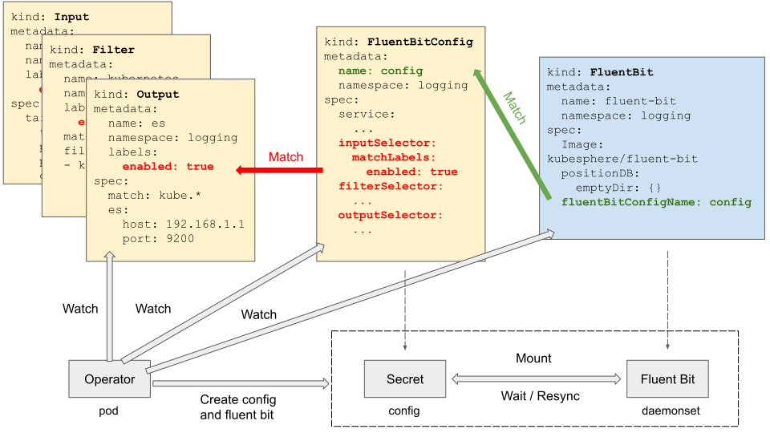
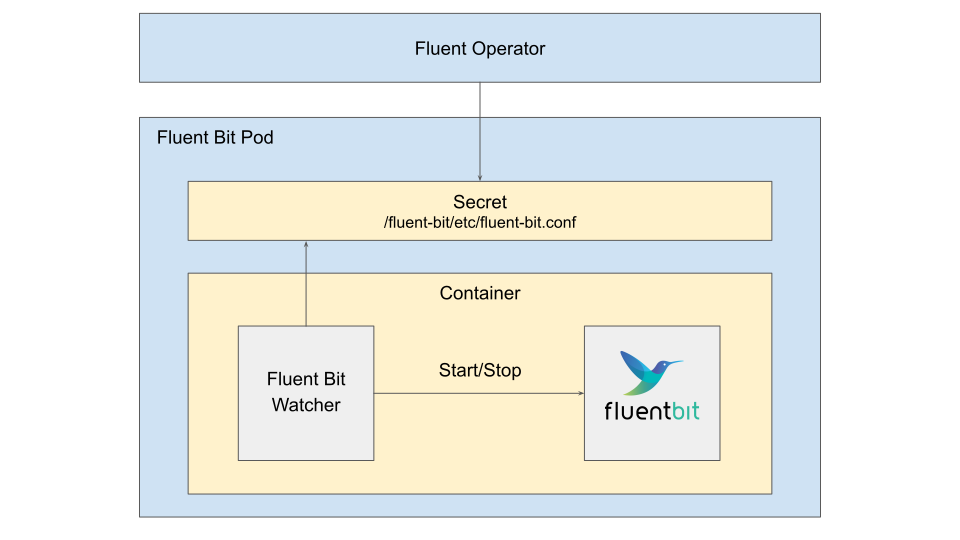
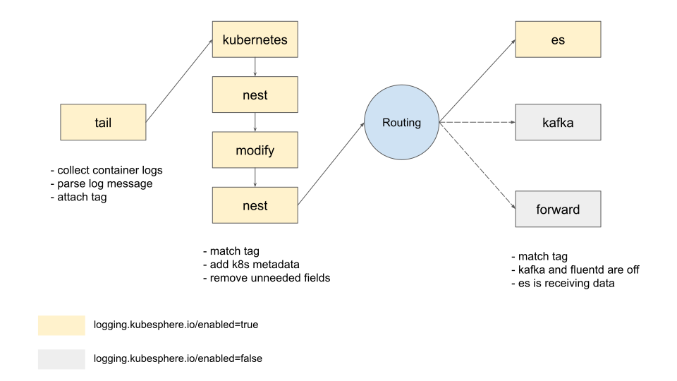

# Fluent Bit Operator

Fluent Bit Operator facilitates the deployment of Fluent Bit and provides great flexibility in building a logging layer based on Fluent Bit.

Once installed, the Fluent Bit Operator provides the following features:

- **Fluent Bit Management**: Deploy and destroy Fluent Bit DaemonSet automatically.
- **Custom Configuration**: Select input/filter/output plugins via labels.
- **Dynamic Reloading**: Update configuration without rebooting Fluent Bit pods.

## Table of contents

- [Fluent Bit Operator](#fluent-bit-operator)
  - [Table of contents](#table-of-contents)
  - [Overview](#overview)
  - [Get Started](#get-started)
    - [Prerequisites](#prerequisites)
    - [Install](#install)
        - [Deploy Fluent Bit Operator with YAML](#deploy-fluent-bit-operator-with-yaml)
        - [Deploy Fluent Bit Operator with Helm](#deploy-fluent-bit-operator-with-helm)
    - [Quick Start](#quick-start)
    - [Configure Custom Watch Namespaces](#configure-custom-watch-namespaces)
    - [Collect Kubernetes logs](#collect-kubernetes-logs)
        - [Deploy the Kubernetes logging stack with YAML](#deploy-the-kubernetes-logging-stack-with-yaml)
        - [Deploy the Kubernetes logging stack with Helm](#deploy-the-kubernetes-logging-stack-with-helm)
    - [Collect auditd logs](#collect-auditd-logs)
    - [Fluentd](#fluentd)
      - [Collecting logs from Fluent Bit](#collecting-logs-from-fluent-bit)
        - [Enable Fluent Bit forward plugin](#enable-fluent-bit-forward-plugin)
        - [ClusterFluentdConfig: Fluentd cluster-wide configuration](#clusterfluentdconfig-fluentd-cluster-wide-configuration)
        - [FluentdConfig: Fluentd namespaced-wide configuration](#fluentdconfig-fluentd-namespaced-wide-configuration)
        - [Combining Fluentd cluster-wide and namespaced-wide configuration](#combining-fluentd-cluster-wide-and-namespaced-wide-configuration)
        - [Combining Fluentd cluster-wide output and namespace-wide output for the multi-tenant scenario](#combining-fluentd-cluster-wide-output-and-namespace-wide-output-for-the-multi-tenant-scenario)
        - [Outputing logs to Kafka or Elasticsearch](#outputing-logs-to-kafka-or-elasticsearch)
        - [Using buffer for Fluentd output](#using-buffer-for-fluentd-output)
      - [Collecting logs over HTTP](#collecting-logs-over-http)
  - [Monitoring](#monitoring)
  - [API Doc](#api-doc)
    - [Fluent Bit](#fluent-bit)
    - [Fluentd](#fluentd-1)
  - [Best Practice](#best-practice)
    - [Plugin Grouping](#plugin-grouping)
    - [Path Convention](#path-convention)
  - [Custom Parser](#custom-parser)
  - [Roadmap](#roadmap)
  - [Development](#development)
    - [Requirements](#requirements)
    - [Running](#running)
  - [Contributing](#contributing)
    - [Documentation](#documentation)
    - [Manifests](#manifests)

## Overview

Fluent Bit Operator defines five custom resources using CustomResourceDefinition (CRD):

- **`FluentBit`**: Defines the Fluent Bit DaemonSet and its configs. A custom Fluent Bit image `kubesphere/fluent-bit` is required to work with FluentBit Operator for dynamic configuration reloading.
- **`FluentBitConfig`**: Select input/filter/output plugins and generates the final config into a Secret.
- **`Input`**: Defines input config sections.
- **`Parser`**: Defines parser config sections.
- **`Filter`**: Defines filter config sections.
- **`Output`**: Defines output config sections.

Each **`Input`**, **`Parser`**, **`Filter`**, **`Output`** represents a Fluent Bit config section, which are selected by **`FluentBitConfig`** via label selectors. The operator watches those objects, constructs the final config, and finally creates a Secret to store the config. This secret will be mounted into the Fluent Bit DaemonSet. The entire workflow looks like below:



To enable fluent-bit to pick up and use the latest config whenever the fluent-bit config changes, a wrapper called fluent-bit watcher is added to restart the fluent-bit process as soon as fluent-bit config changes are detected. This way the fluent-bit pod needn't be restarted to reload the new config. The fluent-bit config is reloaded in this way because there is no reload interface in fluent-bit itself. Please refer to this [known issue](https://github.com/fluent/fluent-bit/issues/365) for more details.



Now users can use Fluentd to perform more advanced processing on logs received from fluent-bit and then forward logs to more sinks like S3, Kafka, Elasticsearch, etc. The whole workflow could be described as below.


## Get Started

### Prerequisites

Kubernetes v1.16.13+ is necessary for running Fluent Bit Operator.

### Install

##### Deploy Fluent Bit Operator with YAML

Install the latest stable version

```shell
kubectl apply -f https://raw.githubusercontent.com/kubesphere/fluentbit-operator/release-0.12/manifests/setup/setup.yaml

# You can change the namespace in manifests/setup/kustomization.yaml in corresponding release branch 
# and then use command below to install to another namespace
# kubectl kustomize manifests/setup/ | kubectl apply -f -
```

Install the development version

```shell
kubectl apply -f https://raw.githubusercontent.com/kubesphere/fluentbit-operator/master/manifests/setup/setup.yaml

# You can change the namespace in manifests/setup/kustomization.yaml 
# and then use command below to install to another namespace
# kubectl kustomize manifests/setup/ | kubectl apply -f -
```

##### Deploy Fluent Bit Operator with Helm

> Note: For the Helm-based installation you need Helm v3.2.1 or later.

Fluent Bit Operator supports `docker` as well as `containerd` and `CRI-O`. `containerd` and `CRI-O` use the `CRI Log` format which is slightly different and requires additional parsing to parse JSON application logs. You should set different `containerRuntime` depending on  your container runtime.

If your container runtime is `docker`

```shell
helm install fluent-operator  --create-namespace -n fluent charts/fluent-operator/ --set containerRuntime=docker
```

If your container runtime is `containerd`

```shell
helm install fluent-operator --create-namespace -n fluent charts/fluent-operator/  --set containerRuntime=containerd
```

If your container runtime is `cri-o`

```shell
helm install fluent-operator --create-namespace -n fluent charts/fluent-operator/  --set containerRuntime=crio
```

### Quick Start

The quick start instructs you to deploy fluent bit with `dummy` as input and `stdout` as output, which is equivalent to execute the binary with `fluent-bit -i dummy -o stdout`.

```shell
kubectl apply -f https://raw.githubusercontent.com/kubesphere/fluentbit-operator/master/manifests/quick-start/quick-start.yaml
```

Once everything is up, you'll observe messages in fluent bit pod logs like below:

```shell
[0] my_dummy: [1587991566.000091658, {"message"=>"dummy"}]
[1] my_dummy: [1587991567.000061572, {"message"=>"dummy"}]
[2] my_dummy: [1587991568.000056842, {"message"=>"dummy"}]
[3] my_dummy: [1587991569.000896217, {"message"=>"dummy"}]
[0] my_dummy: [1587991570.000172328, {"message"=>"dummy"}]
```

It means the FluentBit Operator works properly if you see the above messages, you can delete the quick start test by

```shell
kubectl delete -f https://raw.githubusercontent.com/kubesphere/fluentbit-operator/master/manifests/quick-start/quick-start.yaml
```

### Configure Custom Watch Namespaces

When starting the operator, you can pass an optional set of namespaces to watch for resources in with the `--watch-namespaces` flag. It takes a comma-separated list of namespaces to watch:

```
...
      spec:
        containers:
          image: kubesphere/fluentbit-operator
        - args:
          - --watch-namespaces=namespace1,namespace2
```

### Collect Kubernetes logs

This guide provisions a logging pipeline including the Fluent Bit DaemonSet and its log input/filter/output configurations to collect Kubernetes logs including container logs and kubelet logs.



> Note that you need a running Elasticsearch v5+ cluster to receive log data before start. **Remember to adjust [output-elasticsearch.yaml](manifests/logging-stack/output-elasticsearch.yaml) to your own es setup**. Kafka and Fluentd outputs are optional and are turned off by default.

##### Deploy the Kubernetes logging stack with YAML

```shell
kubectl apply -f manifests/logging-stack

# You can change the namespace in manifests/logging-stack/kustomization.yaml 
# and then use command below to install to another namespace
# kubectl kustomize manifests/logging-stack/ | kubectl apply -f -
```

##### Deploy the Kubernetes logging stack with Helm

If your container runtime is `docker`

```shell
helm upgrade fluent-operator --create-namespace -n fluent charts/fluent-operator/  --set Kubernetes=true,containerRuntime=docker
```

If your container runtime is `containerd`

```shell
helm upgrade fluent-operator --create-namespace -n fluent charts/fluent-operator/  --set Kubernetes=true,containerRuntime=containerd
```

If your container runtime is `cri-o`

```shell
helm upgrade fluent-operator --create-namespace -n fluent charts/fluent-operator/  --set Kubernetes=true,containerRuntime=crio
```

If you want to install the fluentd plugin, you can execute the following command:

If your container runtime is `docker`

```shell
helm upgrade fluent-operator --create-namespace -n fluent charts/fluent-operator/  --set Kubernetes=true,containerRuntime=docker,fluentd.enable=true
```

If your container runtime is `containerd`

```shell
helm upgrade fluent-operator --create-namespace -n fluent charts/fluent-operator/  --set Kubernetes=true,containerRuntime=containerd,fluentd.enable=true
```

If your container runtime is `cri-o`

```shell
helm upgrade fluent-operator --create-namespace -n fluent charts/fluent-operator/  --set Kubernetes=true,containerRuntime=crio,fluentd.enable=true
```

Within a couple of minutes, you should observe an index available:

```shell
$ curl localhost:9200/_cat/indices
green open ks-logstash-log-2020.04.26 uwQuoO90TwyigqYRW7MDYQ 1 1  99937 0  31.2mb  31.2mb
```

Success!

### Collect auditd logs

The Linux audit framework provides a CAPP-compliant (Controlled Access Protection Profile) auditing system that reliably collects information about any security-relevant (or non-security-relevant) event on a system. Refer to `manifests/logging-stack/auditd`, it supports a method for collecting audit logs from the Linux audit framework.

```shell
kubectl apply -f manifests/logging-stack/auditd

# You can change the namespace in manifests/logging-stack/auditd/kustomization.yaml 
# and then use command below to install to another namespace
# kubectl kustomize manifests/logging-stack/auditd/ | kubectl apply -f -
```

Within a couple of minutes, you should observe an index available:

```shell
$ curl localhost:9200/_cat/indices
green open ks-logstash-log-2021.04.06 QeI-k_LoQZ2h1z23F3XiHg  5 1 404879 0 298.4mb 149.2mb
```

### Fluentd 

Fluentd acts as a log forward layer that receives logs from Fluent Bit or other Apps through the network.

#### Collecting logs from Fluent Bit

##### Enable Fluent Bit forward plugin

At first, you should enable the forward plugin in Fluent Bit to send logs to Fluentd.

```shell
cat <<EOF | kubectl apply -f -
apiVersion: fluentbit.fluent.io/v1alpha2
kind: ClusterOutput
metadata:
  name: fluentd
  labels:
    fluentbit.fluent.io/enabled: "true"
    fluentbit.fluent.io/component: logging
spec:
  matchRegex: (?:kube|service)\.(.*)
  forward:
    host: fluentd-forward.kubesphere-logging-system.svc
    port: 24224
EOF
```

And secondly, Fluentd also needs to use the forward input plugin to receive these input logs. This part has been combined into the following examples.

##### ClusterFluentdConfig: Fluentd cluster-wide configuration

```shell
cat <<EOF | kubectl apply -f -
apiVersion: fluentd.fluent.io/v1alpha1
kind: Fluentd
metadata:
  name: fluentd
  namespace: kubesphere-logging-system
  labels:
    app.kubernetes.io/name: fluentd
spec:
  globalInputs:
  - forward: 
      bind: 0.0.0.0
      port: 24224
  replicas: 1
  image: kubesphere/fluentd:v1.14.4
  fluentdCfgSelector: 
    matchLabels:
      config.fluentd.fluent.io/enabled: "true"
   
---
apiVersion: fluentd.fluent.io/v1alpha1
kind: ClusterFluentdConfig
metadata:
  name: fluentd-config
  labels:
    config.fluentd.fluent.io/enabled: "true"
spec:
  watchedNamespaces: 
  - kube-system
  - kubesphere-monitoring-system
  clusterOutputSelector:
    matchLabels:
      output.fluentd.fluent.io/enabled: "true"

---
apiVersion: fluentd.fluent.io/v1alpha1
kind: ClusterOutput
metadata:
  name: fluentd-output-es
  labels:
    output.fluentd.fluent.io/enabled: "true"
spec: 
  outputs: 
  - elasticsearch:
      host: elasticsearch-logging-data.kubesphere-logging-system.svc
      port: 9200
      logstashFormat: true
      logstashPrefix: ks-logstash-log
EOF
```

##### FluentdConfig: Fluentd namespaced-wide configuration

```shell
cat <<EOF | kubectl apply -f -
apiVersion: fluentd.fluent.io/v1alpha1
kind: Fluentd
metadata:
  name: fluentd
  namespace: kubesphere-logging-system
  labels:
    app.kubernetes.io/name: fluentd
spec:
  globalInputs:
  - forward: 
      bind: 0.0.0.0
      port: 24224
  replicas: 1
  image: kubesphere/fluentd:v1.14.4
  fluentdCfgSelector: 
    matchLabels:
      config.fluentd.fluent.io/enabled: "true"
   
---
apiVersion: fluentd.fluent.io/v1alpha1
kind: FluentdConfig
metadata:
  name: fluentd-config
  namespace: kubesphere-logging-system
  labels:
    config.fluentd.fluent.io/enabled: "true"
spec:
  outputSelector:
    matchLabels:
      output.fluentd.fluent.io/enabled: "true"

---
apiVersion: fluentd.fluent.io/v1alpha1
kind: Output
metadata:
  name: fluentd-output-es
  namespace: kubesphere-logging-system
  labels:
    output.fluentd.fluent.io/enabled: "true"
spec: 
  outputs: 
  - elasticsearch:
      host: elasticsearch-logging-data.kubesphere-logging-system.svc
      port: 9200
      logstashFormat: true
      logstashPrefix: ks-logstash-log
EOF
```

##### Combining Fluentd cluster-wide and namespaced-wide configuration

```shell
cat <<EOF | kubectl apply -f -
apiVersion: fluentd.fluent.io/v1alpha1
kind: Fluentd
metadata:
  name: fluentd
  namespace: kubesphere-logging-system
  labels:
    app.kubernetes.io/name: fluentd
spec:
  globalInputs:
  - forward: 
      bind: 0.0.0.0
      port: 24224
  replicas: 1
  image: kubesphere/fluentd:v1.14.4
  fluentdCfgSelector: 
    matchLabels:
      config.fluentd.fluent.io/enabled: "true"
   
---
apiVersion: fluentd.fluent.io/v1alpha1
kind: ClusterFluentdConfig
metadata:
  name: fluentd-config
  labels:
    config.fluentd.fluent.io/enabled: "true"
spec:
  watchedNamespaces: 
  - kube-system
  - kubesphere-monitoring-system
  clusterOutputSelector:
    matchLabels:
      output.fluentd.fluent.io/enabled: "true"

---
apiVersion: fluentd.fluent.io/v1alpha1
kind: FluentdConfig
metadata:
  name: fluentd-config
  namespace: kubesphere-logging-system
  labels:
    config.fluentd.fluent.io/enabled: "true"
spec:
  clusterOutputSelector:
    matchLabels:
      output.fluentd.fluent.io/enabled: "true"

---
apiVersion: fluentd.fluent.io/v1alpha1
kind: ClusterOutput
metadata:
  name: fluentd-output-es
  labels:
    output.fluentd.fluent.io/enabled: "true"
spec: 
  outputs: 
  - elasticsearch:
      host: elasticsearch-logging-data.kubesphere-logging-system.svc
      port: 9200
      logstashFormat: true
      logstashPrefix: ks-logstash-log
EOF
```

##### Combining Fluentd cluster-wide output and namespace-wide output for the multi-tenant scenario

```shell
cat <<EOF | kubectl apply -f -
apiVersion: fluentd.fluent.io/v1alpha1
kind: Fluentd
metadata:
  name: fluentd
  namespace: kubesphere-logging-system
  labels:
    app.kubernetes.io/name: fluentd
spec:
  globalInputs:
  - forward: 
      bind: 0.0.0.0
      port: 24224
  replicas: 1
  image: kubesphere/fluentd:v1.14.4
  fluentdCfgSelector: 
    matchLabels:
      config.fluentd.fluent.io/enabled: "true"
   
---
apiVersion: fluentd.fluent.io/v1alpha1
kind: FluentdConfig
metadata:
  name: fluentd-config-user1
  namespace: kubesphere-logging-system
  labels:
    config.fluentd.fluent.io/enabled: "true"
spec:
  outputSelector:
    matchLabels:
      output.fluentd.fluent.io/enabled: "true"
      output.fluentd.fluent.io/user: "user1"
  clusterOutputSelector:
    matchLabels:
      output.fluentd.fluent.io/enabled: "true"
      output.fluentd.fluent.io/role: "log-operator"

---
apiVersion: fluentd.fluent.io/v1alpha1
kind: ClusterFluentdConfig
metadata:
  name: fluentd-config-cluster
  labels:
    config.fluentd.fluent.io/enabled: "true"
spec:
  watchedNamespaces: 
  - kube-system
  - kubesphere-system
  clusterOutputSelector:
    matchLabels:
      output.fluentd.fluent.io/enabled: "true"
      output.fluentd.fluent.io/scope: "cluster"

---
apiVersion: fluentd.fluent.io/v1alpha1
kind: Output
metadata:
  name: fluentd-output-user1
  namespace: kubesphere-logging-system
  labels:
    output.fluentd.fluent.io/enabled: "true"
    output.fluentd.fluent.io/user: "user1"
spec: 
  outputs: 
  - elasticsearch:
      host: elasticsearch-logging-data.kubesphere-logging-system.svc
      port: 9200
      logstashFormat: true
      logstashPrefix: ks-logstash-log-user1

---
apiVersion: fluentd.fluent.io/v1alpha1
kind: ClusterOutput
metadata:
  name: fluentd-output-log-operator
  labels:
    output.fluentd.fluent.io/enabled: "true"
    output.fluentd.fluent.io/role: "log-operator"
spec: 
  outputs: 
  - elasticsearch:
      host: elasticsearch-logging-data.kubesphere-logging-system.svc
      port: 9200
      logstashFormat: true
      logstashPrefix: ks-logstash-log-operator

---
apiVersion: fluentd.fluent.io/v1alpha1
kind: ClusterOutput
metadata:
  name: fluentd-output-cluster
  labels:
    output.fluentd.fluent.io/enabled: "true"
    output.fluentd.fluent.io/scope: "cluster"
spec: 
  outputs: 
  - elasticsearch:
      host: elasticsearch-logging-data.kubesphere-logging-system.svc
      port: 9200
      logstashFormat: true
      logstashPrefix: ks-logstash-log
EOF
```

##### Outputing logs to Kafka or Elasticsearch

```shell
cat <<EOF | kubectl apply -f -
apiVersion: fluentd.fluent.io/v1alpha1
kind: Fluentd
metadata:
  name: fluentd
  namespace: kubesphere-logging-system
  labels:
    app.kubernetes.io/name: fluentd
spec:
  globalInputs:
  - forward: 
      bind: 0.0.0.0
      port: 24224
  replicas: 1
  image: kubesphere/fluentd:v1.14.4
  fluentdCfgSelector: 
    matchLabels:
      config.fluentd.fluent.io/enabled: "true"

---
apiVersion: fluentd.fluent.io/v1alpha1
kind: ClusterFluentdConfig
metadata:
  name: fluentd-config
  labels:
    config.fluentd.fluent.io/enabled: "true"
spec:
  watchedNamespaces: 
  - kube-system
  - kubesphere-monitoring-system
  clusterFilterSelector:
    matchLabels:
      filter.fluentd.fluent.io/enabled: "true"
  clusterOutputSelector:
    matchLabels:
      output.fluentd.fluent.io/enabled: "true"

---
apiVersion: fluentd.fluent.io/v1alpha1
kind: ClusterFilter
metadata:
  name: fluentd-filter
  labels:
    filter.fluentd.fluent.io/enabled: "true"
spec: 
  filters: 
  - recordTransformer:
      enableRuby: true
      records:
      - key: kubernetes_ns
        value: ${record["kubernetes"]["namespace_name"]}

---
apiVersion: fluentd.fluent.io/v1alpha1
kind: ClusterOutput
metadata:
  name: fluentd-output-kafka
  labels:
    output.fluentd.fluent.io/enabled: "true"
spec: 
  outputs: 
  - kafka:
      brokers: my-cluster-kafka-bootstrap.default.svc:9091,my-cluster-kafka-bootstrap.default.svc:9092,my-cluster-kafka-bootstrap.default.svc:9093
      useEventTime: true
      topicKey: kubernetes_ns
EOF
```

```shell
cat <<EOF | kubectl apply -f -
apiVersion: fluentd.fluent.io/v1alpha1
kind: Fluentd
metadata:
  name: fluentd
  namespace: kubesphere-logging-system
  labels:
    app.kubernetes.io/name: fluentd
spec:
  globalInputs:
  - forward: 
      bind: 0.0.0.0
      port: 24224
  replicas: 1
  image: kubesphere/fluentd:v1.14.4
  fluentdCfgSelector: 
    matchLabels:
      config.fluentd.fluent.io/enabled: "true"
   
---
apiVersion: fluentd.fluent.io/v1alpha1
kind: ClusterFluentdConfig
metadata:
  name: fluentd-config
  labels:
    config.fluentd.fluent.io/enabled: "true"
spec:
  watchedNamespaces: 
  - kube-system
  - kubesphere-monitoring-system
  clusterOutputSelector:
    matchLabels:
      output.fluentd.fluent.io/enabled: "true"

---
apiVersion: fluentd.fluent.io/v1alpha1
kind: ClusterOutput
metadata:
  name: fluentd-output-es
  labels:
    output.fluentd.fluent.io/enabled: "true"
spec: 
  outputs: 
  - elasticsearch:
      host: elasticsearch-logging-data.kubesphere-logging-system.svc
      port: 9200
      logstashFormat: true
      logstashPrefix: ks-logstash-log
EOF
```

##### Using buffer for Fluentd output

```shell
cat <<EOF | kubectl apply -f -
apiVersion: fluentd.fluent.io/v1alpha1
kind: Fluentd
metadata:
  name: fluentd
  namespace: kubesphere-logging-system
  labels:
    app.kubernetes.io/name: fluentd
spec:
  globalInputs:
  - forward: 
      bind: 0.0.0.0
      port: 24224
  replicas: 3
  image: kubesphere/fluentd:v1.14.4
  fluentdCfgSelector: 
    matchLabels:
      config.fluentd.fluent.io/enabled: "true"

---
apiVersion: fluentd.fluent.io/v1alpha1
kind: ClusterFluentdConfig
metadata:
  name: fluentd-config
  labels:
    config.fluentd.fluent.io/enabled: "true"
spec:
  watchedNamespaces: 
  - kube-system
  - kubesphere-monitoring-system
  clusterFilterSelector:
    matchLabels:
      filter.fluentd.fluent.io/enabled: "true"
  clusterOutputSelector:
    matchLabels:
      output.fluentd.fluent.io/enabled: "true"

---
apiVersion: fluentd.fluent.io/v1alpha1
kind: ClusterFilter
metadata:
  name: fluentd-filter
  labels:
    filter.fluentd.fluent.io/enabled: "true"
spec: 
  filters: 
  - recordTransformer:
      enableRuby: true
      records:
      - key: kubernetes_ns
        value: ${record["kubernetes"]["namespace_name"]}

---
apiVersion: fluentd.fluent.io/v1alpha1
kind: ClusterOutput
metadata:
  name: fluentd-output
  labels:
    output.fluentd.fluent.io/enabled: "true"
spec: 
  outputs: 
  - stdout: {}
    buffer:
      type: file
      path: /buffers/stdout.log
  - elasticsearch:
      host: elasticsearch-logging-data.kubesphere-logging-system.svc
      port: 9200
      logstashFormat: true
      logstashPrefix: ks-logstash-log
    buffer:
      type: file
      path: /buffers/es.log
EOF
```

#### Collecting logs over HTTP

```shell
cat <<EOF | kubectl apply -f -
apiVersion: fluentd.fluent.io/v1alpha1
kind: Fluentd
metadata:
  name: fluentd-http
  namespace: kubesphere-logging-system
  labels:
    app.kubernetes.io/name: fluentd
spec:
  globalInputs:
    - http: 
        bind: 0.0.0.0
        port: 9880
  replicas: 1
  image: kubesphere/fluentd:v1.14.4
  fluentdCfgSelector: 
    matchLabels:
      config.fluentd.fluent.io/enabled: "true"
   
---
apiVersion: fluentd.fluent.io/v1alpha1
kind: FluentdConfig
metadata:
  name: fluentd-config
  namespace: kubesphere-logging-system
  labels:
    config.fluentd.fluent.io/enabled: "true"
spec:
  filterSelector:
    matchLabels:
      filter.fluentd.fluent.io/enabled: "true"
  outputSelector:
    matchLabels:
      output.fluentd.fluent.io/enabled: "true"

---
apiVersion: fluentd.fluent.io/v1alpha1
kind: Filter
metadata:
  name: fluentd-filter
  namespace: kubesphere-logging-system
  labels:
    filter.fluentd.fluent.io/enabled: "true"
spec: 
  filters: 
    - stdout: {}

---
apiVersion: fluentd.fluent.io/v1alpha1
kind: Output
metadata:
  name: fluentd-stdout
  namespace: kubesphere-logging-system
  labels:
    output.fluentd.fluent.io/enabled: "true"
spec: 
  outputs: 
    - stdout: {}
EOF
```

## Monitoring

Fluent Bit comes with a built-in HTTP Server. According to the official [documentation](https://docs.fluentbit.io/manual/administration/monitoring) of fluentbit You can enable this by enabling the HTTP server from the fluent bit configuration file:

```conf
[SERVICE]
    HTTP_Server  On
    HTTP_Listen  0.0.0.0
    HTTP_PORT    2020
```

When you use the fluent-operator, You can enable this from `FluentBitConfig` manifest. Example is below:

```yaml
apiVersion: fluentbit.fluent.io/v1alpha2
kind: FluentBitConfig
metadata:
  name: fluent-bit-config
  namespace: logging-system
spec:
  filterSelector:
    matchLabels:
      fluentbit.fluent.io/enabled: 'true'
  inputSelector:
    matchLabels:
      fluentbit.fluent.io/enabled: 'true'
  outputSelector:
    matchLabels:
      fluentbit.fluent.io/enabled: 'true'
  service:
    httpListen: 0.0.0.0
    httpPort: 2020
    httpServer: true
    parsersFile: parsers.conf

```

Once HTTP server is enabled, you should be able to get the information:

```bash
curl <podIP>:2020 | jq .

{
  "fluent-bit": {
    "version": "1.8.3",
    "edition": "Community",
    "flags": [
      "FLB_HAVE_PARSER",
      "FLB_HAVE_RECORD_ACCESSOR",
      "FLB_HAVE_STREAM_PROCESSOR",
      "FLB_HAVE_TLS",
      "FLB_HAVE_OPENSSL",
      "FLB_HAVE_AWS",
      "FLB_HAVE_SIGNV4",
      "FLB_HAVE_SQLDB",
      "FLB_HAVE_METRICS",
      "FLB_HAVE_HTTP_SERVER",
      "FLB_HAVE_SYSTEMD",
      "FLB_HAVE_FORK",
      "FLB_HAVE_TIMESPEC_GET",
      "FLB_HAVE_GMTOFF",
      "FLB_HAVE_UNIX_SOCKET",
      "FLB_HAVE_PROXY_GO",
      "FLB_HAVE_JEMALLOC",
      "FLB_HAVE_LIBBACKTRACE",
      "FLB_HAVE_REGEX",
      "FLB_HAVE_UTF8_ENCODER",
      "FLB_HAVE_LUAJIT",
      "FLB_HAVE_C_TLS",
      "FLB_HAVE_ACCEPT4",
      "FLB_HAVE_INOTIFY"
    ]
  }
}
```


## API Doc

### Fluent Bit

The list below shows supported plugins which are based on Fluent Bit v1.7.x+. For more information, please refer to the API docs of each plugin.

- [Input](docs/fluentbit.md#input)
  - [dummy](docs/plugins/fluentbit/input/dummy.md)
  - [tail](docs/plugins/fluentbit/input/tail.md)
  - [systemd](docs/plugins/fluentbit/input/systemd.md)
- [Parser](docs/fluentbit.md#parser)
  - [json](docs/plugins/fluentbit/parser/json.md)
  - [logfmt](docs/plugins/fluentbit/parser/logfmt.md)
  - [lstv](docs/plugins/fluentbit/parser/lstv.md)
  - [regex](docs/plugins/fluentbit/parser/regex.md)
- [Filter](docs/fluentbit.md#filter)
  - [kubernetes](docs/plugins/fluentbit/filter/kubernetes.md)
  - [modify](docs/plugins/fluentbit/filter/modify.md)
  - [nest](docs/plugins/fluentbit/filter/nest.md)
  - [parser](docs/plugins/fluentbit/filter/parser.md)
  - [grep](docs/plugins/fluentbit/filter/grep.md)
  - [record modifier](docs/plugins/fluentbit/filter/recordmodifier.md)
  - [lua](docs/plugins/fluentbit/filter/lua.md)
  - [throttle](docs/plugins/fluentbit/filter/throttle.md)
  - [aws](docs/plugins/fluentbit/filter/aws.md)
  - [multiline](docs/plugins/fluentbit/filter/multiline.md)
- [Output](docs/fluentbit.md#output)
  - [elasticsearch](docs/plugins/fluentbit/output/elasticsearch.md)
  - [file](docs/plugins/fluentbit/output/file.md)
  - [forward](docs/plugins/fluentbit/output/forward.md)
  - [http](docs/plugins/fluentbit/output/http.md)
  - [kafka](docs/plugins/fluentbit/output/kafka.md)
  - [null](docs/plugins/fluentbit/output/null.md)
  - [stdout](docs/plugins/fluentbit/output/stdout.md)
  - [tcp](docs/plugins/fluentbit/output/tcp.md)
  - [loki](docs/plugins/fluentbit/output/loki.md)
  - [syslog](docs/plugins/fluentbit/output/syslog.md)
  - [datadog](docs/plugins/fluentbit/output/datadog.md)

### Fluentd

The list below shows supported plugins which are based on Fluentd v1.14.4+. For more information, please refer to the API docs of each plugin.

- Common
  - [buffer](docs/plugins/fluentd/common/buffer.md)
  - [format](docs/plugins/fluentd/common/format.md)
  - [parse](docs/plugins/fluentd/common/parse.md)
  - [time](docs/plugins/fluentd/common/common.md#time)
  - [inject](docs/plugins/fluentd/common/common.md#inject)
  - [security](docs/plugins/fluentd/common/common.md#security)
  - [user](docs/plugins/fluentd/common/common.md#user)
  - [transport](docs/plugins/fluentd/common/common.md#transport)
  - [client](docs/plugins/fluentd/common/common.md#client)
  - [auth](docs/plugins/fluentd/common/common.md#auth)
  - [server](docs/plugins/fluentd/common/common.md#server)
  - [service_discovery](docs/plugins/fluentd/common/common.md#ServiceDiscovery)
- [Input](docs/fluentd/input/types.md)
  - [http](docs/plugins/fluentd/input/http.md)
  - [forward](docs/plugins/fluentd/input/forward.md)
- [Filter](docs/fluentd/filter/types.md)
  - [parser](docs/plugins/fluentd/filter/parser.md)
  - [grep](docs/plugins/fluentd/filter/grep.md)
  - [record modifier](docs/plugins/fluentd/filter/record_modifier.md)
  - [stdout](docs/plugins/fluentd/filter/stdout.md)
- [Output](docs/plugins/fluentd/output/types.md)
  - [elasticsearch](docs/plugins/fluentd/output/elasticsearch.md)
  - [forward](docs/plugins/fluentd/output/forward.md)
  - [http](docs/plugins/fluentd/output/http.md)
  - [kafka](docs/plugins/fluentd/output/kafka.md)
  - stdout


## Best Practice

### Plugin Grouping

Input, filter, and output plugins are connected by label selectors. For input and output plugins, always create `Input` or `Output` CRs for every plugin. Don't aggregate multiple inputs or outputs into one `Input` or `Output` object, except you have a good reason to do so. Take the demo `logging stack` for example, we have one yaml file for each output.

However, for filter plugins, if you want a filter chain, the order of filters matters. You need to organize multiple filters into an array as the demo [logging stack](manifests/logging-stack/filter-kubernetes.yaml) suggests.

### Path Convention

Path to file in Fluent Bit config should be well regulated. Fluent Bit Operator adopts the following convention internally.

|Dir Path|Description|
|---|---|
|/fluent-bit/tail|Stores tail related files, eg. file tracking db. Using [fluentbit.spec.positionDB](docs/fluentbit.md#fluentbitspec) will mount a file `pos.db` under this dir by default.|
|/fluent-bit/secrets/{secret_name}|Stores secrets, eg. TLS files. Specify secrets to mount in [fluentbit.spec.secrets](docs/fluentbit.md#fluentbitspec), then you have access.|
|/fluent-bit/config|Stores the main config file and user-defined parser config file.|

> Note that ServiceAccount files are mounted at `/var/run/secrets/kubernetes.io/serviceaccount`.

## Custom Parser

To enable parsers, you must set the value of `FluentBitConfig.Spec.Service.ParsersFile` to `parsers.conf`. Your custom parsers will be included into the built-in parser config via `@INCLUDE /fluent-bit/config/parsers.conf`. Note that the parsers.conf contains a few built-in parsers, for example, docker. Read [parsers.conf](https://github.com/kubesphere/fluentbit-operator/blob/master/conf/parsers.conf) for more information.

Check out the demo in the folder `/manifests/regex-parser` for how to use a custom regex parser.

## Roadmap

- [x] Support containerd log format
- [x] Add Fluentd CRDs as the log aggregation layer with group name `fluentd.fluent.io`
- [x] Add FluentBit Cluster CRDs with new group name `fluentbit.fluent.io`
- [ ] Rename the entire project to Fluent Operator
- [ ] Support more Fluentd & FluentBit plugins

## Development

### Requirements
- golang v1.16+.requirement
- kubectl v1.16.13+.
- kubebuilder v2.3+ (the project is build with v2.3.2)
- Access to a Kubernetes cluster v1.16.13+

### Running

1. Install CRDs: `make install`
2. Run: `make run`

## Contributing

### Documentation

[API Doc](docs/fluentbit.md) is generated automatically. To modify it, edit the comment above struct fields, then run `go run cmd/doc-gen/main.go`.

### Manifests

Most files under the folder [manifests/setup](manifests/setup) are automatically generated from [config](config). Don't edit them directly, run `make manifests` instead, then replace these files accordingly.
