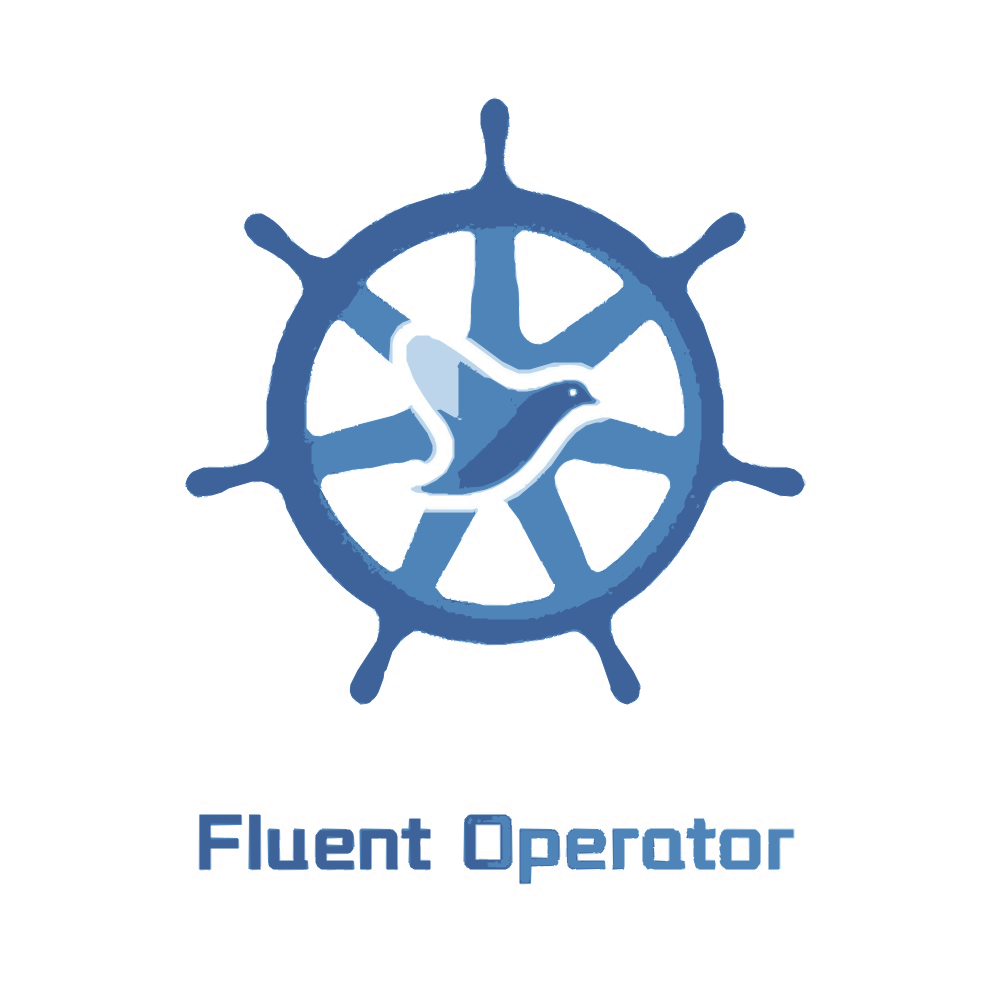

<p align="center">
<a href="https://github.com/fluent/fluent-operator"></a>
</p>

<p align="center">
<b>Facilitate the management of <i>Fluent Bit and Fluentd</i> in Kubernetes</b>
</p>

<p align=center>
<a href="https://goreportcard.com/report/github.com/fluent/fluent-operator"></a>
<a href="https://github.com/fluent/fluent-operator/issues?q=is%3Aissue+is%3Aopen+label%3A%22good+first+issue%22"></a>
<a href="https://twitter.com/intent/follow?screen_name=KubeSphere"></a>
<a href="https://fluent-all.slack.com/archives/C02642TE9HR"></a>

# Fluent Operator

Fluent Operator provides great flexibility in building a logging layer based on Fluent Bit and Fluentd.

Once installed, the Fluent Operator provides the following features:

- **Fluent Bit Management**: Deploy and destroy Fluent Bit DaemonSet automatically.
- **Fluentd Management**: Deploy and destroy Fluentd StatefulSet automatically.
- **Custom Configuration**: Select input/filter/output plugins via labels.
- **Dynamic Reloading**: Update configuration without rebooting Fluent Bit and Fluentd pods.
- **Multi-tenant log isolation**: Fluentd supports multi-tenant log isolation through `label_router` plugin.
- **Pluggable deployment components**: Either Fluent Bit or Fluentd can be deployed separately.

## Table of contents
<!-- TOC -->

- [Fluent Operator](#fluent-operator)
	- [Table of contents](#table-of-contents)
	- [Overview](#overview)
		- [Fluent Bit](#fluent-bit)
		- [Fluentd](#fluentd)
	- [Get Started](#get-started)
		- [Prerequisites](#prerequisites)
		- [Install](#install)
			- [Deploy Fluent Operator with YAML](#deploy-fluent-operator-with-yaml)
			- [Deploy Fluent Operator with Helm](#deploy-fluent-operator-with-helm)
		- [Fluent Operator Walkthrough](#fluent-operator-walkthrough)
		- [Collect Kubernetes logs](#collect-kubernetes-logs)
			- [Deploy the Kubernetes logging stack with YAML](#deploy-the-kubernetes-logging-stack-with-yaml)
			- [Deploy the Kubernetes logging stack with Helm](#deploy-the-kubernetes-logging-stack-with-helm)
		- [Collect auditd logs](#collect-auditd-logs)
		- [Fluentd](#fluentd-1)
	- [Monitoring](#monitoring)
	- [Plugins](#plugins)
		- [Fluent Bit](#fluent-bit-1)
		- [Fluentd](#fluentd-2)
	- [Best Practice](#best-practice)
		- [Plugin Grouping](#plugin-grouping)
		- [Path Convention](#path-convention)
	- [Custom Parser](#custom-parser)
	- [Roadmap](#roadmap)
	- [Development](#development)
		- [Requirements](#requirements)
		- [Running](#running)
	- [Contributing](#contributing)
		- [Documentation](#documentation)
		- [Manifests](#manifests)
	- [Community](#community)
		- [About the community](#about-the-community)
		- [Contact us](#contact-us)
	- [Videos and blogs](#videos-and-blogs)

<!-- /TOC -->

## Overview

Although both Fluent Bit and Fluentd can collect, process(parse and filter) and then forward log to the final destinations, still they have strengths in different aspects.

Fluent Bit is a good choice as a logging agent because of its lightweight and efficiency, while Fluentd is more powerful to perform advanced processing on logs because of its rich plugins.

- Fluent Bit only mode: If you just need to collect logs and send logs to the final destinations, all you need is Fluent Bit.
- Fluent Bit + Fluentd mode: If you also need to perform some advanced processing on the logs collected or send to more sinks, then you also need Fluentd.
- Fluentd only mode: If you need to receive logs through networks like HTTP or Syslog and then process and send the log to the final sinks, you only need Fluentd.

Fluent Operator includes CRDs and controllers for both Fluent Bit and Fluentd which allows you to config your log processing pipelines in the 3 modes mentioned above as you wish.

Fluent Bit will be deployed as a DaemonSet while Fluentd will be deployed as a StatefulSet. The whole workflow could be described as below:


### Fluent Bit

The following CRDs are defined for Fluent Bit:
- **`FluentBit`**: Defines the Fluent Bit DaemonSet and its configs. A custom Fluent Bit image `kubesphere/fluent-bit` is required to work with FluentBit Operator for dynamic configuration reloading.
- **`ClusterFluentBitConfig`**: Select cluster-level input/filter/output plugins and generates the final config into a Secret.
- **`ClusterInput`**: Defines cluster-level input config sections.
- **`clusterParser`**: Defines cluster-level parser config sections.
- **`ClusterFilter`**: Defines cluster-level filter config sections.
- **`ClusterOutput`**: Defines cluster-level output config sections.

Each **`ClusterInput`**, **`ClusterParser`**, **`ClusterFilter`**, **`ClusterOutput`** represents a Fluent Bit config section, which are selected by **`ClusterFluentBitConfig`** via label selectors. Fluent Operator watches those objects, constructs the final config, and finally creates a Secret to store the config which will be mounted into the Fluent Bit DaemonSet. The entire workflow looks like below:


To enable Fluent Bit to pick up and use the latest config whenever the Fluent Bit config changes, a wrapper called Fluent Bit watcher is added to restart the Fluent Bit process as soon as Fluent Bit config changes are detected. This way, the Fluent Bit pod needn't be restarted to reload the new config. The Fluent Bit config is reloaded in this way because there is no reloading interface in Fluent Bit itself. Please refer to this [known issue](https://github.com/fluent/fluent-bit/issues/365) for more details.


### Fluentd

The following CRDs are defined for Fluentd:

- **`Fluentd`**: Defines the Fluentd Statefulset and its configs. A custom Fluentd image `kubesphere/fluentd` is required to work with Fluentd Operator for dynamic configuration reloading.
- **`FluentdConfig`**: Select cluster-level or namespace-level scope input/filter/output plugins and generates the final config into a Secret.
- **`ClusterFluentdConfig`**: Select cluster-level input/filter/output plugins and generates the final config into a Secret.
- **`Filter`**: Defines namespace-level filter config sections.
- **`ClusterFilter`**: Defines cluster-level filter config sections.
- **`Output`**: Defines namespace-level output config sections.
- **`ClusterOutput`**: Defines cluster-level output config sections.

## Get Started

### Prerequisites

Kubernetes v1.16.13+ is necessary for running Fluent Operator.

### Install

#### Deploy Fluent Operator with YAML

Install the latest stable version

```shell
kubectl apply -f https://raw.githubusercontent.com/fluent/fluent-operator/release-1.0/manifests/setup/setup.yaml

# You can change the namespace in manifests/setup/kustomization.yaml in corresponding release branch 
# and then use command below to install to another namespace
# kubectl kustomize manifests/setup/ | kubectl apply -f -
```

Install the development version

```shell
kubectl apply -f https://raw.githubusercontent.com/fluent/fluentbit-operator/master/manifests/setup/setup.yaml

# You can change the namespace in manifests/setup/kustomization.yaml 
# and then use command below to install to another namespace
# kubectl kustomize manifests/setup/ | kubectl apply -f -
```

#### Deploy Fluent Operator with Helm

> Note: For the helm based install, Helm v3.2.1 or higher is needed.

The Fluent Bit section of the Fluent Operator supports different CRI `docker`, `containerd`,  and `CRI-O`. 
`containerd` and `CRI-O` use the `CRI Log` format which is different with `docker`, they requires additional parser to parse JSON application logs. You should set different `containerRuntime` depending on your container runtime.

The default runtime is docker, you can choose other runtimes as follows.

If your container runtime is `containerd`:

```shell
helm install fluent-operator --create-namespace -n fluent charts/fluent-operator/  --set containerRuntime=containerd
```

If your container runtime is `cri-o`:

```shell
helm install fluent-operator --create-namespace -n fluent charts/fluent-operator/  --set containerRuntime=crio
```

Install through the online chart link:

```shell
helm install fluent-operator --create-namespace -n fluent https://github.com/fluent/fluent-operator/releases/download/< version >/fluent-operator.tgz
```

> Please replace < version > with a actual version like v1.0.0

### Fluent Operator Walkthrough

For more info on various use cases of Fluent Operator, you can refer to [Fluent-Operator-Walkthrough](https://github.com/kubesphere-sigs/fluent-operator-walkthrough).

### Collect Kubernetes logs

This guide provisions a logging pipeline including the Fluent Bit DaemonSet and its log input/filter/output configurations to collect Kubernetes logs including container logs and kubelet logs.


> Note that you need a running Elasticsearch v5+ cluster to receive log data before start. **Remember to adjust [output-elasticsearch.yaml](manifests/logging-stack/output-elasticsearch.yaml) to your own es setup**. Kafka and Fluentd outputs are optional and are turned off by default.

#### Deploy the Kubernetes logging stack with YAML

```shell
kubectl apply -f manifests/logging-stack

# You can change the namespace in manifests/logging-stack/kustomization.yaml 
# and then use command below to install to another namespace
# kubectl kustomize manifests/logging-stack/ | kubectl apply -f -
```

#### Deploy the Kubernetes logging stack with Helm

If your container runtime is `docker`

```shell
helm upgrade fluent-operator --create-namespace -n fluent charts/fluent-operator/  --set Kubernetes=true,containerRuntime=docker
```

If your container runtime is `containerd`

```shell
helm upgrade fluent-operator --create-namespace -n fluent charts/fluent-operator/  --set Kubernetes=true,containerRuntime=containerd
```

If your container runtime is `cri-o`

```shell
helm upgrade fluent-operator --create-namespace -n fluent charts/fluent-operator/  --set Kubernetes=true,containerRuntime=crio
```

If you want to install the fluentd plugin, you can execute the following command:

If your container runtime is `docker`

```shell
helm upgrade fluent-operator --create-namespace -n fluent charts/fluent-operator/  --set Kubernetes=true,containerRuntime=docker,fluentd.enable=true
```

If your container runtime is `containerd`

```shell
helm upgrade fluent-operator --create-namespace -n fluent charts/fluent-operator/  --set Kubernetes=true,containerRuntime=containerd,fluentd.enable=true
```

If your container runtime is `cri-o`

```shell
helm upgrade fluent-operator --create-namespace -n fluent charts/fluent-operator/  --set Kubernetes=true,containerRuntime=crio,fluentd.enable=true
```

Within a couple of minutes, you should observe an index available:

```shell
$ curl localhost:9200/_cat/indices
green open ks-logstash-log-2020.04.26 uwQuoO90TwyigqYRW7MDYQ 1 1  99937 0  31.2mb  31.2mb
```

Success!

### Collect auditd logs

The Linux audit framework provides a CAPP-compliant (Controlled Access Protection Profile) auditing system that reliably collects information about any security-relevant (or non-security-relevant) event on a system. Refer to `manifests/logging-stack/auditd`, it supports a method for collecting audit logs from the Linux audit framework.

```shell
kubectl apply -f manifests/logging-stack/auditd

# You can change the namespace in manifests/logging-stack/auditd/kustomization.yaml 
# and then use command below to install to another namespace
# kubectl kustomize manifests/logging-stack/auditd/ | kubectl apply -f -
```

Within a couple of minutes, you should observe an index available:

```shell
$ curl localhost:9200/_cat/indices
green open ks-logstash-log-2021.04.06 QeI-k_LoQZ2h1z23F3XiHg  5 1 404879 0 298.4mb 149.2mb
```

### Fluentd 

Fluentd acts as a log forward layer that receives logs from Fluent Bit or other Apps through the network.

For more info on various use cases of Fluent Operator Fluentd CRDs, you can refer to [Fluent-Operator-Walkthrough](https://github.com/kubesphere-sigs/fluent-operator-walkthrough#fluent-bit--fluentd-mode).

## Monitoring

Fluent Bit comes with a built-in HTTP Server. According to the official [documentation](https://docs.fluentbit.io/manual/administration/monitoring) of fluentbit You can enable this by enabling the HTTP server from the fluent bit configuration file:

```conf
[SERVICE]
    HTTP_Server  On
    HTTP_Listen  0.0.0.0
    HTTP_PORT    2020
```

When you use the fluent-operator, You can enable this from `FluentBitConfig` manifest. Example is below:

```yaml
apiVersion: fluentbit.fluent.io/v1alpha2
kind: ClusterFluentBitConfig
metadata:
  name: fluent-bit-config
  labels:
    app.kubernetes.io/name: fluent-bit
spec:
  filterSelector:
    matchLabels:
      fluentbit.fluent.io/enabled: 'true'
  inputSelector:
    matchLabels:
      fluentbit.fluent.io/enabled: 'true'
  outputSelector:
    matchLabels:
      fluentbit.fluent.io/enabled: 'true'
  service:
    httpListen: 0.0.0.0
    httpPort: 2020
    httpServer: true
    parsersFile: parsers.conf

```

Once HTTP server is enabled, you should be able to get the information:

```bash
curl <podIP>:2020 | jq .

{
  "fluent-bit": {
    "version": "1.8.3",
    "edition": "Community",
    "flags": [
      "FLB_HAVE_PARSER",
      "FLB_HAVE_RECORD_ACCESSOR",
      "FLB_HAVE_STREAM_PROCESSOR",
      "FLB_HAVE_TLS",
      "FLB_HAVE_OPENSSL",
      "FLB_HAVE_AWS",
      "FLB_HAVE_SIGNV4",
      "FLB_HAVE_SQLDB",
      "FLB_HAVE_METRICS",
      "FLB_HAVE_HTTP_SERVER",
      "FLB_HAVE_SYSTEMD",
      "FLB_HAVE_FORK",
      "FLB_HAVE_TIMESPEC_GET",
      "FLB_HAVE_GMTOFF",
      "FLB_HAVE_UNIX_SOCKET",
      "FLB_HAVE_PROXY_GO",
      "FLB_HAVE_JEMALLOC",
      "FLB_HAVE_LIBBACKTRACE",
      "FLB_HAVE_REGEX",
      "FLB_HAVE_UTF8_ENCODER",
      "FLB_HAVE_LUAJIT",
      "FLB_HAVE_C_TLS",
      "FLB_HAVE_ACCEPT4",
      "FLB_HAVE_INOTIFY"
    ]
  }
}
```


## Plugins 

### Fluent Bit

[Here](docs/plugins/fluentbit/index.md) you can find supported Fluent Bit plugins.

### Fluentd

[Here](docs/plugins/fluentd/index.md) you can find supported Fluentd plugins.

## Best Practice

### Plugin Grouping

Input, filter, and output plugins are connected by label selectors. For input and output plugins, always create `Input` or `Output` CRs for every plugin. Don't aggregate multiple inputs or outputs into one `Input` or `Output` object, except you have a good reason to do so. Take the demo `logging stack` for example, we have one yaml file for each output.

However, for filter plugins, if you want a filter chain, the order of filters matters. You need to organize multiple filters into an array as the demo [logging stack](manifests/logging-stack/filter-kubernetes.yaml) suggests.

### Path Convention

Path to file in Fluent Bit config should be well regulated. Fluent Bit Operator adopts the following convention internally.

|Dir Path|Description|
|---|---|
|/fluent-bit/tail|Stores tail related files, eg. file tracking db. Using [fluentbit.spec.positionDB](docs/fluentbit.md#fluentbitspec) will mount a file `pos.db` under this dir by default.|
|/fluent-bit/secrets/{secret_name}|Stores secrets, eg. TLS files. Specify secrets to mount in [fluentbit.spec.secrets](docs/fluentbit.md#fluentbitspec), then you have access.|
|/fluent-bit/config|Stores the main config file and user-defined parser config file.|

> Note that ServiceAccount files are mounted at `/var/run/secrets/kubernetes.io/serviceaccount`.

## Custom Parser

To enable parsers, you must set the value of `FluentBitConfig.Spec.Service.ParsersFile` to `parsers.conf`. Your custom parsers will be included into the built-in parser config via `@INCLUDE /fluent-bit/config/parsers.conf`. Note that the parsers.conf contains a few built-in parsers, for example, docker. Read [parsers.conf](https://github.com/kubesphere/fluentbit-operator/blob/master/conf/parsers.conf) for more information.

Check out the demo in the folder `/manifests/regex-parser` for how to use a custom regex parser.

## Roadmap

- [x] Support containerd log format
- [x] Add Fluentd CRDs as the log aggregation layer with group name `fluentd.fluent.io`
- [x] Add FluentBit Cluster CRDs with new group name `fluentbit.fluent.io`
- [x] Rename the entire project to Fluent Operator
- [ ] Support more Fluentd & FluentBit plugins

## Development

### Requirements
- golang v1.16+.requirement
- kubectl v1.16.13+.
- kubebuilder v2.3+ (the project is build with v2.3.2)
- Access to a Kubernetes cluster v1.16.13+

### Running

1. Install CRDs: `make install`
2. Run: `make run`

## Contributing

### Documentation

[API Doc](docs/fluentbit.md) is generated automatically. To modify it, edit the comment above struct fields, then run `go run cmd/doc-gen/main.go`.

### Manifests

Most files under the folder [manifests/setup](manifests/setup) are automatically generated from [config](config). Don't edit them directly, run `make manifests` instead, then replace these files accordingly.

## Community

### About the community

Fluent Operator is sponsored and open-sourced by the [KubeSphere](http://kubesphere.io/) Team and maintained by the Fluent community. 

This project was accepted by the Fluent community as a sub-project in 2021 and is currently a vendor-neutral and community-driven project. 

### Contact us

You are welcome to join us in the Fluent community to polish it together:

- Slack: Create an account in the [Fluent Slack workspace](https://launchpass.com/fluent-all) and then search `#fluent-operator` to join or click [#fluent-operator](https://fluent-all.slack.com/archives/C02642TE9HR) to join if you already have an account
- Wechat: join the KubeSphere Observability SIG by following the `kubesphere` WeChat subscription
- Bi-weekly Meeting: https://meeting.tencent.com/dm/mZPB9QKdtX0F (You can find the SIG-Observability meeting schedule [here](https://kubesphere.io/contribution/))

## Videos and blogs

- [From FluentBit Operator to Fluent Operator: The Long Way to Come - Benjamin Huo](https://www.youtube.com/watch?v=jvMw0yRYW30)
- [What is Fluent Operator and how do you use it - Henrik Rexed](https://www.youtube.com/watch?v=8I6AnkTkeiI)
- [Under the Hood with Fluent Bit Operator: Kubernetes-native Log Processor - Feynman Zhou & Dhruv Kela](https://youtu.be/jnRFeaP9Uzw)
- [Quick Start: Learn Fluent Operator in 5 minutes (中文) - Dehao Cheng](https://kubesphere.io/zh/blogs/fluent-operator-logging/)