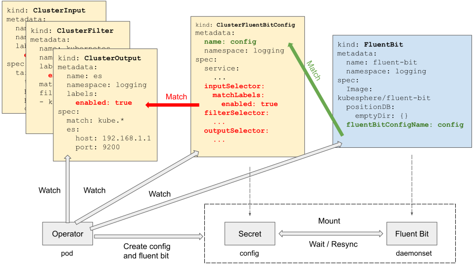

# Fluent Bit Operator

Fluent Bit Operator facilitates the deployment of Fluent Bit and provides great flexibility in building a logging layer based on Fluent Bit.

Once installed, the Fluent Bit Operator provides the following features:

- **Fluent Bit Management**: Deploy and destroy Fluent Bit DaemonSet automatically.
- **Custom Configuration**: Select input/filter/output plugins via labels.
- **Dynamic Reloading**: Update configuration without rebooting Fluent Bit pods.

## Table of contents

- [Overview](#overview)
- [Get Started](#get-started)
  - [Prerequisites](#prerequisites)
  - [Quick Start](#quick-start)
  - [Logging Stack](#logging-stack)
    - [Auditd](#auditd)
- [Monitoring](#monitoring)
- [API Doc](#api-doc)
- [Best Practice](#best-practice)
  - [Plugin Grouping](#plugin-grouping)
  - [Path Convention](#path-convention)
- [Features In Plan](#features-in-plan)
- [Development](#development)
  - [Prerequisites](#prerequisites-1)
  - [Running](#running)
- [Contributing](#contributing)
  - [Documentation](#documentation)
  - [Manifests](#manifests)  
  
## Overview

Fluent Bit Operator defines five custom resources using CustomResourceDefinition (CRD):

- **`FluentBit`**: Defines the Fluent Bit DaemonSet and its configs. A custom Fluent Bit image `kubesphere/fluent-bit` is requried to work with FluentBit Operator for dynamic configuration reloading.
- **`FluentBitConfig`**: Select input/filter/output plugins and generates the final config into a Secret.
- **`Input`**: Defines input config sections.
- **`Parser`**: Defines parser config sections.
- **`Filter`**: Defines filter config sections.
- **`Output`**: Defines output config sections.

Each **`Input`**, **`Parser`**, **`Filter`**, **`Output`** represents a Fluent Bit config section, which are selected by **`FluentBitConfig`** via label selectors. The operator watches those objects, constructs the final config, and finally creates a Secret to store the config. This secret will be mounted into the Fluent Bit DaemonSet. The entire workflow looks like below:



To enable fluent-bit to pick up and use the latest config whenever the fluent-bit config changes, a wrapper called fluent-bit watcher is added to restart the fluent-bit process as soon as fluent-bit config changes are detected. This way the fluent-bit pod needn't be restarted to reload the new config. The fluent-bit config is reloaded in this way because there is no reload interface in fluent-bit itself. Please refer to this [known issue](https://github.com/fluent/fluent-bit/issues/365) for more details.


## Get Started

### Prerequisites

Kubernetes v1.16.13+ is necessary for running Fluent Bit Operator.

### Install

Install the latest stable version

```shell
kubectl apply -f https://raw.githubusercontent.com/kubesphere/fluentbit-operator/release-0.7/manifests/setup/setup.yaml

# You can change the namespace in manifests/setup/kustomization.yaml in corresponding release branch 
# and then use command below to install to another namespace
# kubectl kustomize manifests/setup/ | kubectl apply -f -
```

Install the development version

```shell
kubectl apply -f https://raw.githubusercontent.com/kubesphere/fluentbit-operator/master/manifests/setup/setup.yaml

# You can change the namespace in manifests/setup/kustomization.yaml 
# and then use command below to install to another namespace
# kubectl kustomize manifests/setup/ | kubectl apply -f -
```

### Quick Start

The quick start instructs you to deploy fluent bit with `dummy` as input and `stdout` as output, which is equivalent to execute the binary with `fluent-bit -i dummy -o stdout`.

```shell
kubectl apply -f https://raw.githubusercontent.com/kubesphere/fluentbit-operator/master/manifests/quick-start/quick-start.yaml
```

Once everything is up, you'll observe messages in fluent bit pod logs like below:

```shell
[0] my_dummy: [1587991566.000091658, {"message"=>"dummy"}]
[1] my_dummy: [1587991567.000061572, {"message"=>"dummy"}]
[2] my_dummy: [1587991568.000056842, {"message"=>"dummy"}]
[3] my_dummy: [1587991569.000896217, {"message"=>"dummy"}]
[0] my_dummy: [1587991570.000172328, {"message"=>"dummy"}]
```

It means the FluentBit Operator works properly if you see the above messages, you can delete the quick start test by

```shell
kubectl delete -f https://raw.githubusercontent.com/kubesphere/fluentbit-operator/master/manifests/quick-start/quick-start.yaml
```

### Collect Kubernetes logs

This guide provisions a logging pipeline including the Fluent Bit DaemonSet and its log input/filter/output configurations to collect Kubernetes logs including container logs and kubelet logs.


> Note that you need a running Elasticsearch v5+ cluster to receive log data before start. **Remember to adjust [output-elasticsearch.yaml](manifests/logging-stack/output-elasticsearch.yaml) to your own es setup**. Kafka and Fluentd outputs are optional and are turned off by default.

```shell
kubectl apply -f manifests/logging-stack

# You can change the namespace in manifests/logging-stack/kustomization.yaml 
# and then use command below to install to another namespace
# kubectl kustomize manifests/logging-stack/ | kubectl apply -f -
```

Within a couple of minutes, you should observe an index available:

```shell
$ curl localhost:9200/_cat/indices
green open ks-logstash-log-2020.04.26 uwQuoO90TwyigqYRW7MDYQ 1 1  99937 0  31.2mb  31.2mb
``` 

Success!

### Collect auditd logs

The Linux audit framework provides a CAPP-compliant (Controlled Access Protection Profile) auditing system that reliably collects information about any security-relevant (or non-security-relevant) event on a system. Refer to `manifests/logging-stack/auditd`, it supports a method for collecting audit logs from the Linux audit framework.

```shell
kubectl apply -f manifests/logging-stack/auditd

# You can change the namespace in manifests/logging-stack/auditd/kustomization.yaml 
# and then use command below to install to another namespace
# kubectl kustomize manifests/logging-stack/auditd/ | kubectl apply -f -
```

Within a couple of minutes, you should observe an index available:

```shell
$ curl localhost:9200/_cat/indices
green open ks-logstash-log-2021.04.06 QeI-k_LoQZ2h1z23F3XiHg  5 1 404879 0 298.4mb 149.2mb
```

## Monitoring

Fluent Bit comes with a built-in HTTP Server. According to the official [documentation](https://docs.fluentbit.io/manual/administration/monitoring) of fluentbit You can enable this by enabling the HTTP server from the fluent bit configuration file:

```conf
[SERVICE]
    HTTP_Server  On
    HTTP_Listen  0.0.0.0
    HTTP_PORT    2020
```

When you use the kubesphere/fluentbit-operator, You can enable this from `FluentBitConfig` manifest. Example is below:

```yaml
apiVersion: logging.kubesphere.io/v1alpha2
kind: FluentBitConfig
metadata:
  name: fluent-bit-config
  namespace: logging-system
spec:
  filterSelector:
    matchLabels:
      logging.kubesphere.io/enabled: 'true'
  inputSelector:
    matchLabels:
      logging.kubesphere.io/enabled: 'true'
  outputSelector:
    matchLabels:
      logging.kubesphere.io/enabled: 'true'
  service:
    httpListen: 0.0.0.0
    httpPort: 2020
    httpServer: true
    parsersFile: parsers.conf

```

Once HTTP server is enabled, you should be able to get the information:

```bash
curl <podIP>:2020 | jq .

{
  "fluent-bit": {
    "version": "1.7.3",
    "edition": "Community",
    "flags": [
      "FLB_HAVE_PARSER",
      "FLB_HAVE_RECORD_ACCESSOR",
      "FLB_HAVE_STREAM_PROCESSOR",
      "FLB_HAVE_TLS",
      "FLB_HAVE_OPENSSL",
      "FLB_HAVE_AWS",
      "FLB_HAVE_SIGNV4",
      "FLB_HAVE_SQLDB",
      "FLB_HAVE_METRICS",
      "FLB_HAVE_HTTP_SERVER",
      "FLB_HAVE_SYSTEMD",
      "FLB_HAVE_FORK",
      "FLB_HAVE_TIMESPEC_GET",
      "FLB_HAVE_GMTOFF",
      "FLB_HAVE_UNIX_SOCKET",
      "FLB_HAVE_PROXY_GO",
      "FLB_HAVE_JEMALLOC",
      "FLB_HAVE_LIBBACKTRACE",
      "FLB_HAVE_REGEX",
      "FLB_HAVE_UTF8_ENCODER",
      "FLB_HAVE_LUAJIT",
      "FLB_HAVE_C_TLS",
      "FLB_HAVE_ACCEPT4",
      "FLB_HAVE_INOTIFY"
    ]
  }
}
```


## API Doc

The list below shows supported plugins which are based on Fluent Bit v1.7.x+. For more information, please refer to the API docs of each plugin.

- [Input](docs/crd.md#input)
    - [dummy](docs/plugins/input/dummy.md)
    - [tail](docs/plugins/input/tail.md)
    - [systemd](docs/plugins/input/systemd.md)
- [Parser](docs/crd.md#parser)
    - [json](docs/plugins/parser/json.md)
    - [logfmt](docs/plugins/parser/logfmt.md)
    - [lstv](docs/plugins/parser/lstv.md)
    - [regex](docs/plugins/parser/regex.md)
- [Filter](docs/crd.md#filter)
    - [kubernetes](docs/plugins/filter/kubernetes.md)
    - [modify](docs/plugins/filter/modify.md)
    - [nest](docs/plugins/filter/nest.md) 
    - [parser](docs/plugins/filter/parser.md)
    - [grep](docs/plugins/filter/grep.md)
    - [record modifier](docs/plugins/filter/recordmodifier.md)
    - [lua](docs/plugins/filter/lua.md)
- [Output](docs/crd.md#output)
    - [elasticsearch](docs/plugins/output/elasticsearch.md)
    - [file](docs/plugins/output/file.md)
    - [forward](docs/plugins/output/forward.md)
    - [http](docs/plugins/output/http.md)
    - [kafka](docs/plugins/output/kafka.md)
    - [null](docs/plugins/output/null.md)
    - [stdout](docs/plugins/output/stdout.md)
    - [tcp](docs/plugins/output/tcp.md)
    - [loki](docs/plugins/output/loki.md)
    - [syslog](docs/plugins/output/syslog.md)

## Best Practice

### Plugin Grouping

Input, filter, and output plugins are connected by label selectors. For input and output plugins, always create `Input` or `Output` CRs for every plugin. Don't aggregate multiple inputs or outputs into one `Input` or `Output` object, except you have a good reason to do so. Take the demo `logging stack` for example, we have one yaml file for each output.

However, for filter plugins, if you want a filter chain, the order of filters matters. You need to organize multiple filters into an array as the demo [logging stack](manifests/logging-stack/filter-kubernetes.yaml) suggests.

### Path Convention

Path to file in Fluent Bit config should be well regulated. Fluent Bit Operator adopts the following convention internally.

|Dir Path|Description|
|---|---|
|/fluent-bit/tail|Stores tail related files, eg. file tracking db. Using [fluentbit.spec.positionDB](docs/crd.md#fluentbitspec) will mount a file `pos.db` under this dir by default.|
|/fluent-bit/secrets/{secret_name}|Stores secrets, eg. TLS files. Specify secrets to mount in [fluentbit.spec.secrets](docs/crd.md#fluentbitspec), then you have access.|
|/fluent-bit/config|Stores the main config file and user-defined parser config file.|

> Note that ServiceAccount files are mounted at `/var/run/secrets/kubernetes.io/serviceaccount`.

## Custom Parser

To enable parsers, you must set the value of `FluentBitConfig.Spec.Service.ParsersFile` to `parsers.conf`. Your custom parsers will be included into the built-in parser config via `@INCLUDE /fluent-bit/config/parsers.conf`. Note that the parsers.conf contains a few built-in parsers, for example, docker. Read [parsers.conf](https://github/kubesphere/fluent-bit/blob/v1.6.2-reload/conf/parsers.conf) for more information.

Check out the demo in the folder `/manifests/regex-parser` for how to use a custom regex parser.

## Roadmap 

- [ ] Support containerd log format
- [ ] Add Fluentd CRDs as the log aggregation layer with group name `fluentd.fluent.io`
- [ ] Add FluentBit Cluster CRDs with new group name `fluentbit.fluent.io`
- [ ] Rename the entire project to Fluent Operator
- [ ] Support more Fluentd & FluentBit plugins

## Development

### Prerequisites
- golang v1.13+.
- kubectl v1.16.13+.
- kubebuilder v2.3+ (the project is build with v2.3.2)
- Access to a Kubernetes cluster v1.16.13+

### Running

1. Install CRDs: `make install`
2. Run: `make run`

## Contributing

### Documentation

[API Doc](docs/crd.md) is generated automatically. To modify it, edit the comment above struct fields, then run `go run cmd/doc-gen/main.go`.

### Manifests

Most files under the folder [manifests/setup](manifests/setup) are automatically generated from [config](config). Don't edit them directly, run `make manifests` instead, then replace these files accordingly.
